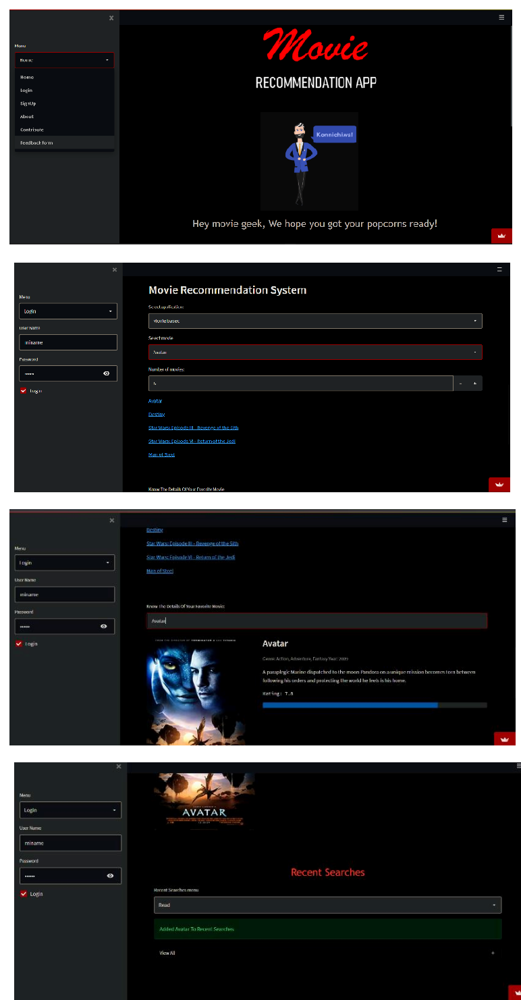
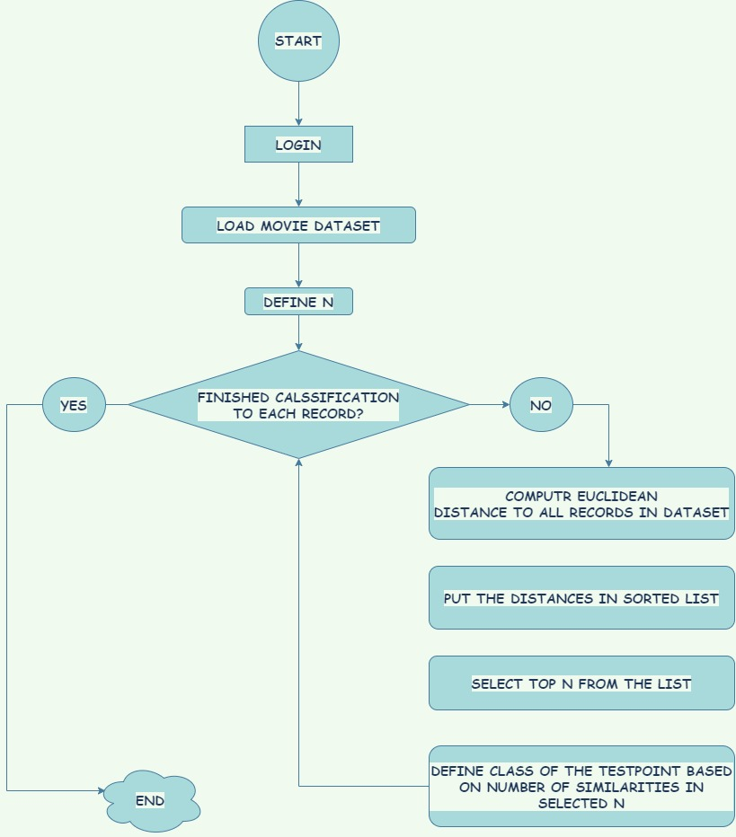
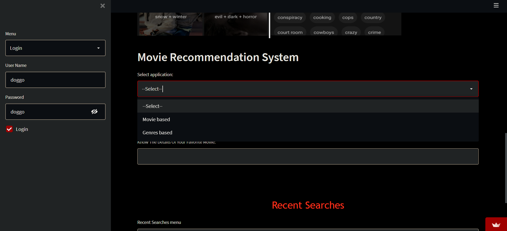
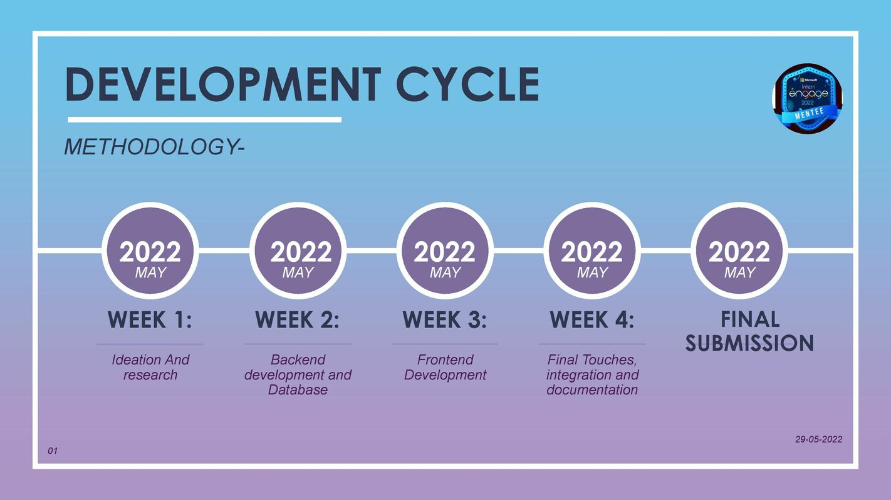

# Movie-Recommendation-Engine-Engage-22-
This is a Movie Recommendation Web app built using Streamlit Framework as a part of Microsoft Engage mentorship Programme 2022


# Movie Recommendation System

RUNNING AT: https://share.streamlit.io/juhii16/movie-recommendation-engine-engage-22-/app.py

[VIDEO DEMO](https://drive.google.com/file/d/1dhYEOvUYYQ4bqgAlUK9krtuJpU2DAL-l/view?usp=sharing)

### Table of Contents
**[Description](#description)**<br>
**[Dataset](#Dataset)**<br>
**[Set-Up](#Set-up )**<br>
**[Architecture](#Architecture)**<br>
**[Features](#Features)**<br>
**[TechnologyUsed](#TechnologyUsed)**<br>
**[Resources](#Resources)**<br>

## Description


This is a Movie Recommendation system which uses K Nearest Neighbour Algorithm to do content based filtering to recommend movies to users based on their input. To fetch the movie plot and IMDb rating it uses OMDb Api.The link for the same is 
https://www.omdbapi.com/

The movie database file which I have used in my project can be found in this git Repo for anyone to use.

In case if you want recent databse so you can visit Kaggle (The link for which is Down below)
[ Link to download dataset from Kaggle ](https://www.kaggle.com/rounakbanik/the-movies-dataset?select=ratings.csv)

**This project aims to be a unique submission under Microsoft Engage 2022 and is made using streamlit which allows development of efficient interactive web apps with a quick and structured development flow(https://streamlit.io/)**
Here is how the interface looks like :



### Dataset

>The dataset consists of movies released on or before July 2017. Data points include cast, crew, plot keywords, budget, revenue, posters, release dates, languages, production companies, countries, TMDB vote counts and vote averages.
>This dataset also has files containing 26 million ratings from 270,000 users for all 5044 movies.
>There are around 26-27 Genre to fliter out your movie.


---
## Architecture 


## How to get API key
Create an account in https://www.omdbapi.com/, click on the API link from the left hand sidebar in your account settings and fill all the details to apply for API key. If you are asked for the website URL, just give "NA" if you don't have one. You will see the API key Sent to your E-mail. And paste your api key in line 261 of app.py file or use api.py file


## Set-up 

Download [python version](https://www.python.org/downloads/release/python-3810/)

1- Clone the git repo or download the zip folder

2- Create a python virtual environment in the project folder directory 
  To create a virtual environment you can visit (here is the link for refrence) https://docs.python.org/3/library/venv.html
  
3-Get your API key 

4- Then install these libraries 

   Streamlit -> Display the app (working on deployment)  
   SQLite3 -> For easier and faster access to the database  
  
````python
pip install -r requirements.txt 
pip3 install -r requirements.txt
````
5- In case if there are any errors in executing above commands try installing packages mentioned in app.py file manually.

6- To run the project, navigate inside the project directory and type the following command in a python terminal or powershell. 
````python
streamlit run app.py
````
   and here you go :)

7- If you Facing difficulty in installation fill the feedback form mentioned in our [App](https://share.streamlit.io/juhii16/movie-recommendation-engine-engage-22-/app.py) with problem mentioned

## Features
Challenge was basically about creating a recommendation system. On above of that I incorporated following features:

   · Sign up for new users

   · Log in for existing users

   · Movie recommendation based on movie searched and genre
 
   · User can further enhance recommendations by setting a minimum IMDb rating

   · User can get a min of 5 and max of 20 movie recommendations and the movie link redirects the user to its IMDb website

   · Search feature to get movie plot, movie poster and IMDb rating

   · User can see last few searches made on the website
 
   · Contribute feature where user can provide a txt file of missing movies for us to enhance the corpus of data
 
   . User can fill a feedback form 


### Types of recommendations
It offers recomendations based on movie and genre (Content Based filtering - using KNN Machine Learning Algorithm)


## TechnologyUsed
   Pandas
   
   Numpy
   
   sqlite3
   
   Python Framework Streamlit
   
   OMDb API Key
   
   Plotly
   
## Development Cycle


## Resources
[ Streamlit Docs](https://docs.streamlit.io/)

[ Link to download dataset from Kaggle ](https://www.kaggle.com/rounakbanik/the-movies-dataset?select=ratings.csv)

[KNN Algorithm](https://www.javatpoint.com/k-nearest-neighbor-algorithm-for-machine-learning)

[Movie recommendation systems](https://www.geeksforgeeks.org/python-implementation-of-movie-recommender-system/?ref=lbp)


